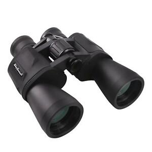
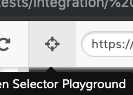
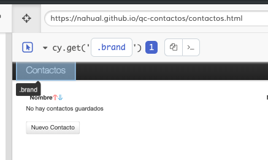
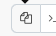

# Cypress - Guía de Supervivencia

# Instalar Cypress
[ver la página de instalación](https://github.com/CentroCatu/automation/blob/master/Doc/InstalarCypress.md )

# Iniciar Cypress

* abrir la terminal
* navegar hasta la carpeta donde está instalado Cypress
* Estando en la misma carpeta donde está el archivo el archivo `package.json` :
```
node_modules/.bin/cypress open
```

Puede tardar, pero se va a abrir Cypress

# Crear un grupo de tests

La primera vez que se inicia, Cypress crea una carpeta que se llama `integration` que adentro tiene otros archivos.

* crear un archivo adentro de la carpeta `integration` que termine con `.spec.js`. Por ejemplo `compra.spec.js`

# Estructura básica
 ``` javascript
/// <reference types="Cypress" />
describe('acciones de compra', function() {
    it('compra una moto', function() {
        // ... acciones para comprar una moto
        // elegir primera moto
        // tocar el botón comprar
    })
    it('compra una auto', function() {
        // ... acciones para comprar un auto
        // elegir el último auto
        // tocar el botón comprar
    })
  })
 ```

 La primera línea : `/// <reference types="Cypress" />` sirve para que el editor de código te pueda sugerir opciones mientras estás escribiendo el test.

 El texto que está después de `describe` es el nombre del grupo de tests

 El texto que está después de `it` es el nombre de la acción que se va a probar

Adentro de cada `it` ( o sea entre `{` y  `}`) van a ir las acciones de cada test

# El contenido de cada test
En un test se hacen mayormente tres tipos de acciones:
* seleccionar un elemento
* interactuar con el elemento seleccionado( por ejemplo: hacer click, escribir)
* comprobar que esté pasando lo que debería pasar ( por ejemplo asegurarse que cuando toco el botón 'cerrar sesión', el título diga 'sesión cerrada')


# Visitar una página

``` javascript
cy.visit('https://www.mercadolibre.com.ar')
```

# Seleccionar un elemento

## Por texto
Cuando queremos seleccionar un elemento que tiene un texto podemos usar `contains`.

Por ejemplo, para apretar un botón que contenga `Cerrar`
``` javascript
 cy.contains('Cerrar')
```

Esto selecciona un elemento que contenga este texto. El botón puede tener más texto, pero si incluye ese texto va a ser seleccionado.

Por ejemplo si hay un título que dice `Bienvenido Roberto ` la línea siguiente

``` javascript
cy.contains('Bienvenido')
 ```

va a seleccionar ese título.

Es muy importante que el texto esté tal cual como está en la página, respetando mayúsculas, puntos y otros detalles.

Nota: 'contains' significa 'contiene' en inglés.


Si hay mas de un elemento que tenga ese texto Cypress va a seleccionar el primer elemento que contenga ese texto.

## Usando el selector de Cypress
Para usar el selector de Cypress hay que tocar el ícono del selector:



Hacer Click en el elemento que queremos seleccionar



Copiar el selector haciendo clicl en el botón copiar
 y pegarlo en el editor de código

## Usando Css
El selector de Cypress no es perfecto y a veces no va a seleccionar lo que ustedes quieren. En este caso van a tener que usar un selector css.

Por ejemplo
``` javascript
cy.get('#cerrar')
```
va a seleccionar un elemento que tenga un `id` 'cerrar' por que el símbolo `#` significa `id`

Todo lo que necesitan saber de selectores css lo pueden aprender jugando este juego: [Comedor CSS](http://cgosorio.es/DW/comedor-css/#)


# Interactuar con un elemento

## Click
Una vez que seleccionaron el elemento pueden hacerle click de la manera siguiente
``` javascript
cy.contains('cerrar').click()
```

## Escribir
``` javascript
cy.get('#queja').type('No me gusta esta página')
```

Hay muchas más cosas que se pueden hacer con los elementos. Para ver más ejemplos pueden ver el archivo que está dentro de la carpeta `Cypress/integration/examples/actions.spec.js`


# Hacer una comprobación
## Comprobar que un elemento tenga exactamente cierto texto

De esta forma se puede comprobar que el titular diga `Menem  2020`
```javascript
cy.get('#titular').should('have.text','Menem 2020')
```
La primera parte  `cy.get('#titular')` selecciona el elemento que tenga el `id` 'titular'.

La segunda parte `should('have.text','Menem 2020')` comprueba que el titular diga exactamente 'Menem 2020'.

En inglés la segunda parte se leería: debería tener texto 'Menem 2020'

Si el texto tiene cualquier detalle diferente (por ejemplo una mayúscula o un espacio) Cypress va a considerar que hay un error


## Comprobar que un elemento contenga por lo menos un texto
De esta forma podemos ver que un elemento contenga un texto.

**Si el elemento tiene más texto no importa**, lo importante es que el texto tenga por lo menos lo que buscamos

``` javascript
cy.get('#titular').should('contain', '2020')
```

En inglés se lee:

cy buscar #titular debería contener 2020

Hay muchas más comprobaciones que se pueden hacer. Hay más ejemplos en la carpeta `Cypress/integration/examples/assertions.spec.js `

# Un test de ejemplo

``` javascript
/// <reference types="Cypress" />
describe('acciones de usuarios', function() {
    it('agrega un usuario', function() {
        cy.visit('https://nahual.github.io/qc-contactos/contactos.html')
        cy.contains('Nuevo Contacto').click()
        cy.get('#contact-name').type('Anselmo')
        cy.get('#contact-mail').type('anselmoaaaaaaaaaaaaaaaaaaaaaaaaa@gmail.com')
        cy.contains('Guardar').click()
        cy.get('.help-inline').should('have.text','El nombre del contacto no puede superar los 35 caracteres')
    })
  })
```

Buena suerte

